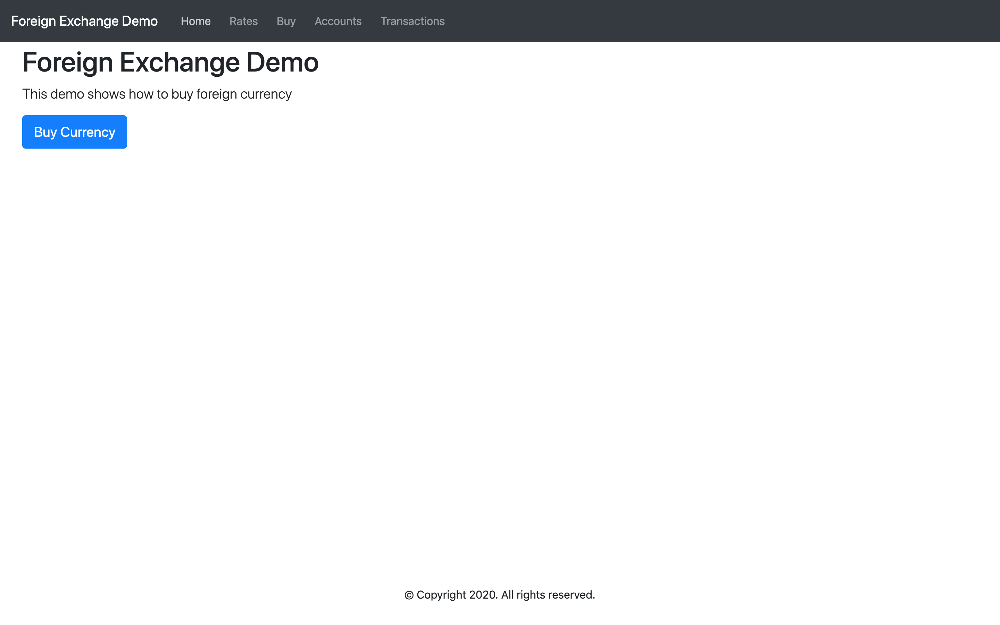
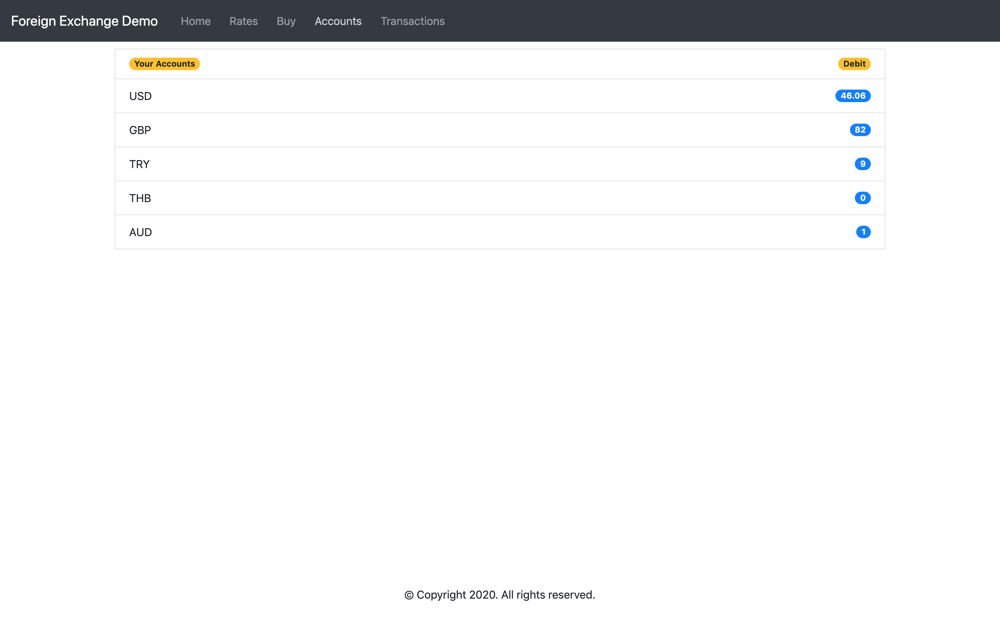
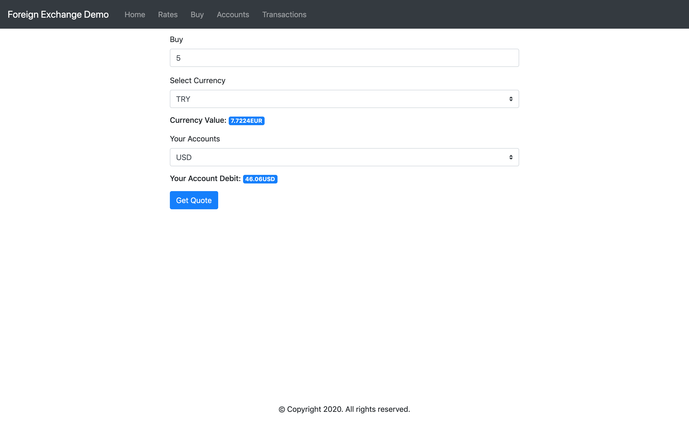
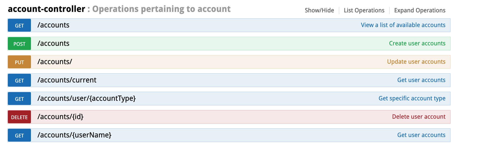
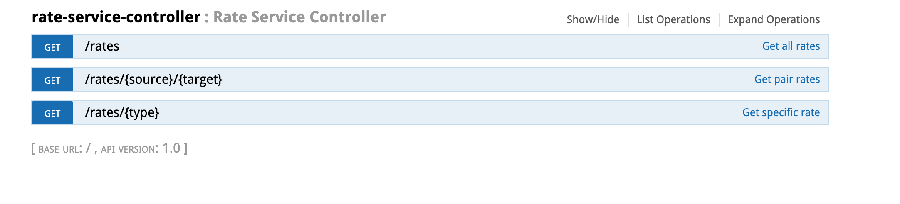
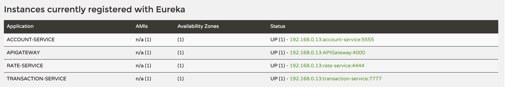
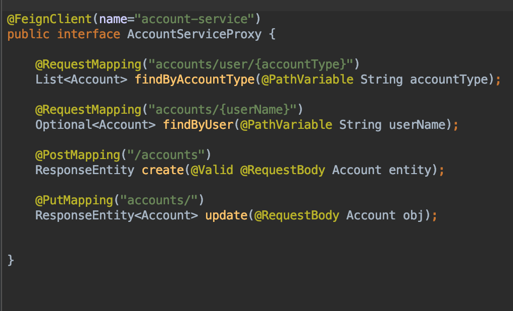
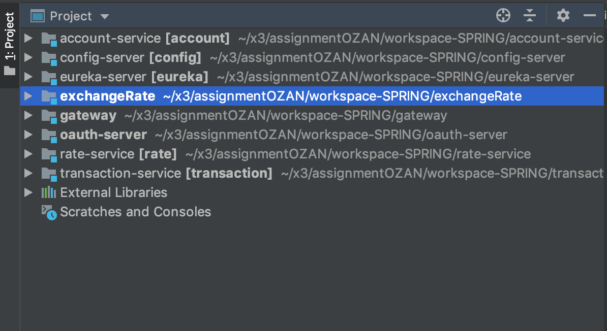

# assignmentOZAN

> 
This is a demo project, which demonstrates Microservice Architecture Pattern and Single Page Application Basics  using Spring Boot, Spring Cloud and Angular.
With a pretty good user interface, by the way.

Application has 5 subsections, which are called by Home, Rates, Buy, Accounts and Transactions respectively. When application is first started, 
you wil have a demo account with predefined currency and debit. These are USD account balanced with 100 credit and other is GBP account balanced with 80 credit.

Here I used reactive form validation pattern thanks to material design of Angular. All fields are required. You should enter amount greaten than 1, otherwise you face with validation error. And you should not buy currency type as your account type, otherwise you can face with validation error "You are not allowed to buy same currency. Please select different account"

## Functional services

Application was built on three core microservices. All are independently deployable applications organized around specific business areas.

## Account service
Contains general user account logic and validation: items, savings and account settings. Below picture shows operations list accomplished by account-service. You can reach swagger UI of account service by clicking link http://localhost:5555/swagger-ui.html after running account-service. For storing accounts, h2 in-memory db is used. While application is starting, it creates demo account on memory by using data.sql file under resources folder.

## Rate service
Rate service is responsible for getting current exchange rates. You can reach swagger UI of rate service by clicking link http://localhost:4444/swagger-ui.html after running rate-service.

## Transaction service
Transaction service is responsible for creating transaction according to user inputs. You can reach swagger UI of rate service by clicking link http://localhost:7777/swagger-ui.html after running transaction-service.

## Config Server
In this project, I used spring cloud config dependency for creating config server. I use native profile, which simply loads config files from the local classpath. You can see shared directory in Config service resources. Now, when rate-service requests its configuration, Config service responses with common-config/rate-service.properties. You can reach config server over http://localhost:8888

## Eureka Server

The other common and important pattern I used in that project is service registry. It allows automatic detection of network locations for service instances, which could have dynamically assigned addresses because of auto-scaling, failures and upgrades. I use Netflix Eureka in this project. Eureka is a good example of the client-side discovery pattern, when client is responsible for determining locations of available service instances (using Registry server) and load balancing requests across them. You can reach eureka server over http://localhost:8761/ and see registred services.

## API GATEWAY

There are three core services, which expose external API to client. As you can see on below picture, gateway is the signle entry point to the system. It routes requests according to the route configuration(below figure) to appropirate microservice. I used netflix zuul for creating APIGateway. Its base URL is : http://localhost:4000/api/v1

## Feign Client

Another used pattern in project is Feign Client principles. I used feign client in transaction-service module for calling account-service and rate-serivce over proxy after buying operation. It seamlessly integrates with Ribbon and Hystrix. So I can update account data on accoun-serive module thanks to feign client. For feign client, i used spring cloud starter openfeign package. You can see on below picture AccountServiceProxy class, which is perfect example of usage of feign.

## Distributed tracing

Spring Cloud Sleuth solves this problem by providing support for distributed tracing. It adds two types of IDs to the logging: traceId and spanId. 

## Security
For security, i used spring-boot-starter-security package for permitting some paths of services and for preventing user from accessing some paths.

## How to run all the things?

## JAVA PROJECT

After you clone project, open workspace-SPRING folder on Intellij. I added project structure figure below. you can do operation maven/install for dependency injection on parent exchangeRate project. Parent(exchangeRate) projects handle maven operation of sub modules . After maven operation is finished, then you can continue with starting spring boot applications by one by. Firstly, you should  start config-server, because other services need config server on starting proccess. Then secondly you can continue with starting eureka server...

1. Start Config Server
2. Start Eureka Server
3. Start Rate Service
4. Start Account Service
5. Start Transaction Service
6. Start APIGateway

## Important endpoints
1. http://localhost:4000/api/v1 - Gateway
2. http://localhost:8761 - Eureka Dashboard

## ANGULAR PROJECT
 Firstly,you can run npm install command under workspace-NG/foreign-exchange folder. After npm install loaded required librarires, then you can continue with simply running ng serve command for starting  angular project. 
 
 You can reach angular web project over http://localhost:4200/home
 
 If port is busy on your local machine, you can change port by using --port attribute. It doesnt matter.
 
 ##  Thank you Guys, If you get an error while trying to run project, Please don't hesitate to contact me.
 ##  My mobile number : +905314561411
